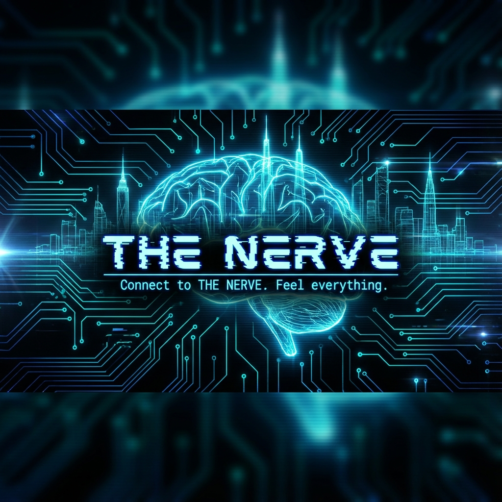

# ⚡ THE NERVE


**A choice-driven cyberpunk RPG for your terminal.**

> _"Connect to THE NERVE. Feel everything."_

---

## 🌆 About

In the neon-soaked streets of Neo-Shenzhen, 2199, you are just another lost soul trying to survive. But the city pulses with a hidden network—**THE NERVE**—a distributed neural system that connects everything and everyone.

Touch it. Use it. Control it. Break it.

Every choice sends a signal through THE NERVE. Every signal has consequences.

**THE NERVE** is a terminal-based RPG that combines:

- ⚡ **Deep roleplay** - Stats and skills unlock unique paths
- 🎭 **Branching narratives** - Your choices matter
- ⚔️ **Tactical combat** - Turn-based with positioning
- 🎨 **Beautiful terminal UI** - Rich colors, ASCII art, Unicode borders

---

## 🚀 Quick Start

```bash
# Clone the repository
git clone https://github.com/s1bgroup/the-nerve.git
cd the-nerve

# Install
./setup.sh

# Play
python -m src.main
```

---

## 📖 Game Features

### 🧠 The Nerve System

The city's underground neural network. Hack it. Influence it. Become part of it.

### 🎯 Stat-Based Roleplay

- `[CHA 12]` dialogue options unlock persuasion paths
- `[INT 11]` choices reveal hidden information
- `[STR 14]` intimidation when words fail

### ⚔️ Turn-Based Combat

- Initiative rolls (`d20 + DEX`)
- Action economy (attack/defend/item/flee)
- Tactical positioning

### 🏙️ Faction Warfare

- **Helix Corporation** (corpo power)
- **Yakuza Syndicate** (street authority)
- **Free Mind Collective** (anti-AI rebels)
- **Neo-Buddhist Movement** (philosophical resistance)

---

## 🎮 Current Status

**Version**: 0.1.0 - Vertical Slice
**Playable Content**: ~15 minutes

### Implemented ✅

- Character creation with stats (STR/DEX/INT/CHA/LCK)
- 1 location (The Golden Drake tavern)
- NPC interaction with skill checks
- Tutorial combat encounter
- Save/load system
- Dice rolling (d20, advantage/disadvantage)

### In Development 🔲

- Full dialogue tree (20+ nodes)
- Enemy AI system
- Multiple locations
- Quest tracking
- Faction reputation
- Leveling and perks

---

## 🛠️ Tech Stack

- **Python 3.11+** - Modern, clean syntax
- **Rich library** - Beautiful terminal rendering
- **JSON data** - Moddable, version-controllable content

---

## 🎮 Controls

### Exploration

```
north/n, south/s, east/e, west/w - Movement
talk [npc] - Start conversation
examine [object] - Inspect
take [item] - Pick up
stats - View character sheet
inventory - View inventory
save - Manual save
quit - Exit game
```

### Combat

```
1 - Attack
2 - Defend (+5 AC for 1 turn)
3 - Use Item
4 - Flee (DEX check)
```

---

## 🏗️ Project Structure

```
the-nerve/
├── src/              # Source code
│   ├── core/         # Game engine (state, events, saves)
│   ├── entities/     # Player, NPCs, enemies
│   ├── systems/      # Combat, dialogue, quests
│   ├── world/        # Locations, encounters
│   ├── ui/           # Terminal rendering
│   ├── data/         # Data loading
│   └── utils/        # Dice, helpers
├── data/             # Game content (JSON)
│   └── genres/
│       └── cyberpunk/
│           ├── locations/
│           ├── npcs/
│           ├── dialogues/
│           ├── enemies/
│           └── items/
├── saves/            # Save files
├── docs/             # Documentation
└── tests/            # Unit tests
```

---

## 📜 License

**MIT License** - See LICENSE file

Free to use, modify, and distribute. Credit appreciated but not required.

---

## 🙏 Credits

**Design & Development**: S1B Group Development Team
**Inspiration**: Fallout 1/2, Baldur's Gate 3, Cyberpunk 2077, Neuromancer

---

⚡ **Connect to THE NERVE. Your story begins now.**

---

**Status**: Pre-Alpha - Vertical Slice Development
**Version**: 0.1.0
**Last Updated**: 2026-01-08
